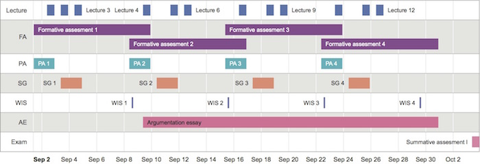

# Background

## Sharon Klinkenberg

* Senior Lecturer Psychological Methods Section, Psy.
    * Scientific and Statistiscal Reasoning
* Co-inventor [Math Garden](https://www.rekentuin.nl)
* Board of Advisors [Oefenweb](https://www.oefenweb.nl)
* Research on Computer Adaptive Testing
* Chairman National Special Interest Group Digital Assessment
* Chairman TestVision Assosiation
* Chairman Works Council FMG UvA

# Scientific and statistical reasoning

## Course outline

BA2 350 students

### Block I / IV

## Course outline

* Lectures
* SG: Mandatory study groups
* FA: Digital formative assessment
* PA: Preparatory assignments
* WIS: Walk-in sessions 
* AE: Argumentation essay
* Exam: Mid term exam

$$\text{Final grade} = .8 \times \overline{Exam} + .2 \times \overline{AE} - SG - FA - PA$$

## Deduction points

| Not met | SG        | PA        | FA         | RM        |
|--------:|-----------|-----------|------------|-----------|
| 1x      | 0         | 0         | 0          | 0         |
| 2x      | 0.25      | 0.1       | 0.1        | 0.25      |
| 3x      | 0.75      | 0.25      | 0.25       | 0.75      |
| 4x      | 1.5       | 0.5       | 0.5        | 1.5       |
| 5x      | 3         | 1         | 1          | 3         |
| 6x      | Exclusion | Exclusion | Exclusion  | Exclusion |

## Digital formative assessment

## Digital formative assessment

* [Remindo](https://uva.remindotoets.nl)
* [Testvision](https://uva.testvision.nl/online/fe/login_tvb.htm)

## Digital formative assessment

* 14 Formative assessments
* No points are given
* Only deduction for not making the assignments

## Lecture Attendance

* Not compulsory
* Registered in the first and final cycle of the course

## Weblectures

Apart from the above described course design, students also have access to the [weblectures](http://webcolleges.uva.nl/Mediasite/Play/bb82160b73f14bed9648b879f8dc4e5e1d?playFrom=4575000) from our campus video lecture capture system. These weblectures are available directly after the lecture has been given.

## Exam {.flexbox .vcenter}

------

# Evaluating course design

## The role of formative assessment in a blended learning course

[Klinkenberg, S. (2017). The role of formative assessment in a blended learning course. In D. Joosten-ten Brinke, & M. Laanpere (Eds.), Technology enhanced assessment: 19th international conference, TEA 2016, tallinn, estonia, october 5-6, 2016, revised selected papers (pp. 63-71). Cham: Springer International Publishing.](https://link.springer.com/chapter/10.1007/978-3-319-57744-9_6)

## Lecture attendance and formative assessment 

Lecture attendance and formative assessment explained 29% $F(2, 271) = 55.2, p < 0.001$ of the variance.

* Lecture attendance $b = −0.006$ $t(271) = −0.31, p > .05$
* Formative assessment $b = 0.22$ $t(271) = 10.49, p < .001$

## Weblectures {.flexbox .vcenter}

# Personalised Learning

## Diagnostics {.smaller}

Use categorised results of assesment to diagnose problems.

## Remediation

Create remediation sessions for "group" intervention.

* Based on interim exam 1 and 2
* Select lowest 25%
* Mandatory

## Preliminary Results

# End

<ul class="fa-ul" style="color:lightgrey;">
<li><i class="fa-li fa fa-twitter"></i> <a href="https://twitter.com/shklinkenberg" target="_blank" style="color:lightgrey; border-bottom:none;">@shklinkenberg</a></li>
<li><i class="fa-li fa fa-linkedin-square"></i> <a href="https://www.linkedin.com/in/sharonklinkenberg/" target="_blank" style="color:lightgrey; border-bottom:none;">Klinkenberg</a></li>
<li><i class="fa-li fa fa-envelope-o"></i> <a style="unicode-bidi:bidi-override; direction: rtl; color:lightgrey" href="javascript:window.location.href = 'mailto:' + ['s.klinkenberg','uva.nl'].join('@')">ln.AvU@grebneknilK.S</a></li>
<li><i class="fa-li fa fa-github"></i> <a href="https://github.com/ShKlinkenberg" target="_blank" style="color:lightgrey; border-bottom:none;">ShKlinkenberg</a></li>
</ul>

