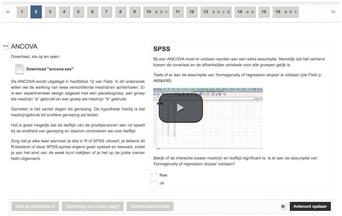
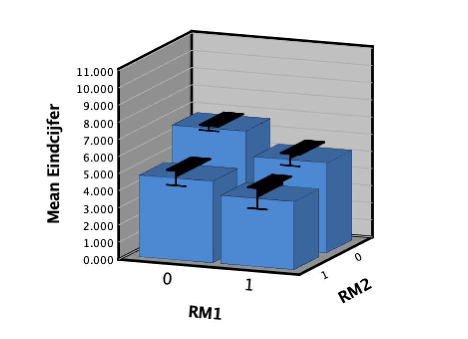

# Background

## Sharon Klinkenberg

* Senior Lecturer Psychological Methods Section, Psy.
    * Scientific and Statistiscal Reasoning
* Co-inventor [Math Garden](https://www.rekentuin.nl)
* Board of Advisors [Oefenweb](https://www.oefenweb.nl)
* Research on Computer Adaptive Testing
* Chairman National Special Interest Group Digital Assessment
* Chairman TestVision Assosiation
* Chairman Works Council FMG UvA

# Deliberate practice

## Anders Ericsson {.flexbox .vcenter}

<iframe style="width:760px; height:415px;" src="https://www.youtube.com/embed/uoUHlZP094Q?start=140" frameborder="0" allow="accelerometer; autoplay; encrypted-media; gyroscope; picture-in-picture" allowfullscreen></iframe>

## In educator {data-background=images/education_cycle_uva.png data-background-size=cover}

# Scientific and statistical reasoning

## Course outline

Bachelor year 2 with around 350 students

### Block I / IV

## Course outline

* Lectures
* SG: Mandatory study groups
* FA: Digital formative assessment
* PA: Preparatory assignments
* RM: Remediation
* WIS: Walk-in sessions 
* AE: Argumentation essay (Bonus)
* Exam: Mid term exam

$$\text{Final grade} = \overline{Exam} +\overline{AE} - SG - FA - PA - RM$$

## Deduction points

| Not met | SG        | PA        | FA         | RM        |
|--------:|-----------|-----------|------------|-----------|
| 1x      | 0         | 0         | 0          | 0         |
| 2x      | 0.25      | 0.1       | 0.1        | 0.25      |
| 3x      | 0.75      | 0.25      | 0.25       | 0.75      |
| 4x      | 1.5       | 0.5       | 0.5        | 1.5       |
| 5x      | 3         | 1         | 1          | 3         |
| 6x      | Exclusion | Exclusion | Exclusion  | Exclusion |

# Instruction

## Instruction

* Lectures / Weblectures
* Knowledge clips
* Book

# Practice

## Practice

* Prepatory assignments
* Tutorials
* Digital formative assessment

## Digital formative assessment

## Digital formative assessment

* [Testvision](https://uva.testvision.nl/online/fe/login_tvb.htm)

## Digital formative assessment

* 14 Formative assessments
* No points are given
* Only deduction for not making the assignments

# Assessment

## Assessment

* Weekly formative assessment
* Tutorials
* Exams

## Exam {.flexbox .vcenter}

------

# Diagnostics

## Diagnostics {.smaller}

Use categorised results of assesment to diagnose problems.

# Remediation

## Remediation

Create remediation sessions for "group" intervention.

* Based on interim exam 1 and 2
* Select lowest 25%
* __Mandatory__

## Preliminary Results

## Compare non mandatrory

## Course grade

# End

<ul class="fa-ul" style="color:lightgrey;">
<li><i class="fa-li fa fa-twitter"></i> <a href="https://twitter.com/shklinkenberg" target="_blank" style="color:lightgrey; border-bottom:none;">@shklinkenberg</a></li>
<li><i class="fa-li fa fa-linkedin-square"></i> <a href="https://www.linkedin.com/in/sharonklinkenberg/" target="_blank" style="color:lightgrey; border-bottom:none;">Klinkenberg</a></li>
<li><i class="fa-li fa fa-envelope-o"></i> <a style="unicode-bidi:bidi-override; direction: rtl; color:lightgrey" href="javascript:window.location.href = 'mailto:' + ['s.klinkenberg','uva.nl'].join('@')">ln.AvU@grebneknilK.S</a></li>
<li><i class="fa-li fa fa-github"></i> <a href="https://github.com/ShKlinkenberg" target="_blank" style="color:lightgrey; border-bottom:none;">ShKlinkenberg</a></li>
</ul>

