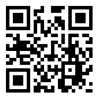

# Beroepssoftware {data-background=#E98300}

##

<iframe width="840" height="473" src="https://www.youtube.com/embed/GbKHIoMxi0A" frameborder="0" allow="accelerometer; autoplay; encrypted-media; gyroscope; picture-in-picture" allowfullscreen></iframe>

# Digitaal Toetsen aan de UvA {data-background=#BC0031}

## {data-background="images/zaal.png" data-background-size=contain}

# Niet schaalbaar

## {data-background="images/Digitale-toetszaal-UU.jpg" data-background-size=cover}

# Beperking

##

> Geen desktop $\neq$ Authentiek toetsen

# Cloud {data-background=#BC0031}

## {data-background="https://communities.surf.nl/files/styles/image_paragraph_large/public/paragraph/image/8fc195dbea0df6ce8b1177e030024833_surf-sig-dt-24-05-2019vmvisualv4.jpg?itok=3H8H3eFH" data-background-size=contain}

## SIG Digitaal Toetsen

> [Naar een inrichtingsmodel voor flexibele en veilige toetsafname](https://communities.surf.nl/artikel/naar-een-inrichtingsmodel-voor-flexibele-en-veilige-toetsafname)

# Dank voor uw aandacht {data-background=#BC0031}

## Link presentatie

> [qrgo.page.link/kPV34](https://qrgo.page.link/kPV34)

