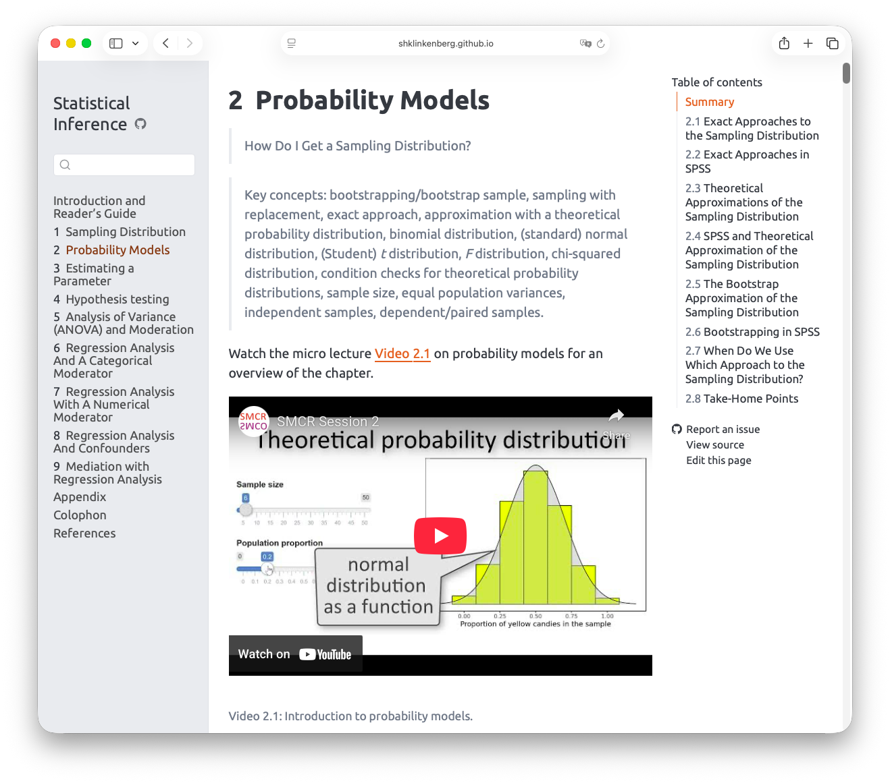
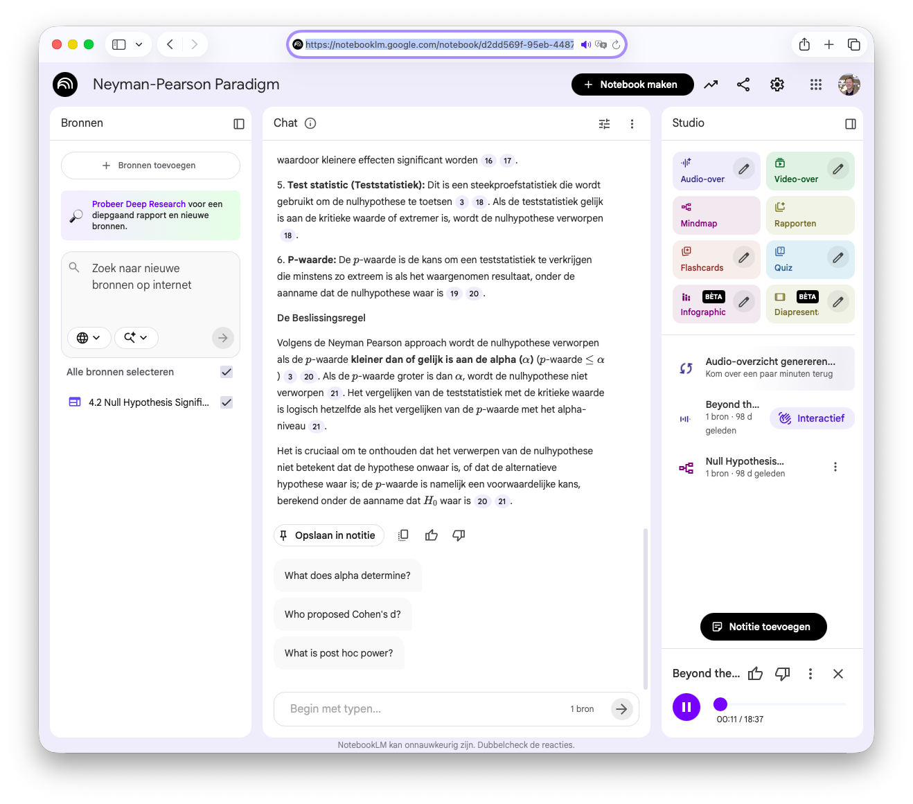
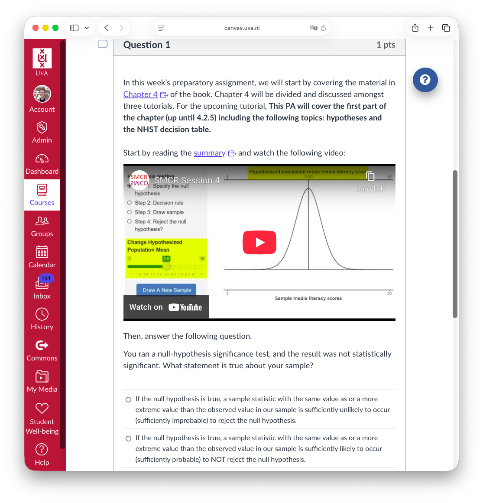
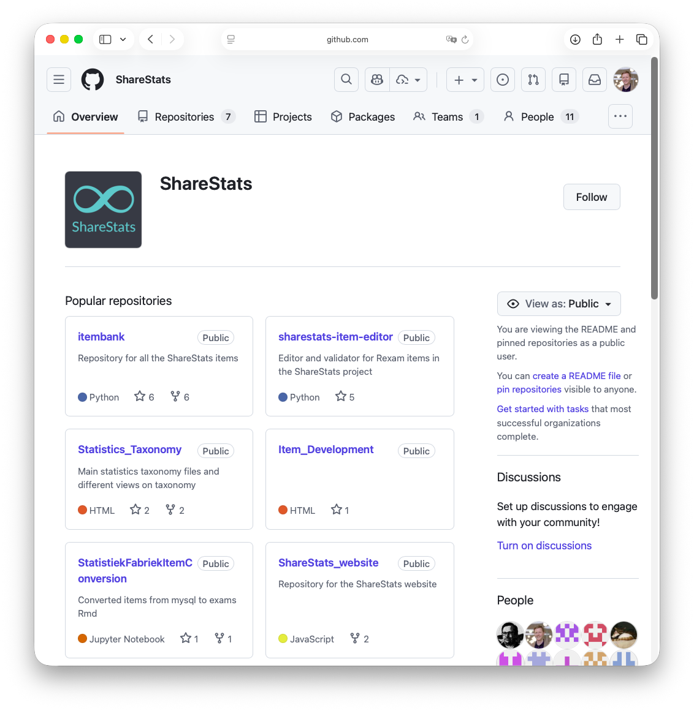

# Personalized Learning and Media Diversity {data-background="newsletter_article/images/digital_campus.png" data-background-color="black" style="background-color: rgba(0, 0, 0, 0.5) !important; padding:10px; border-radius: 10px;"}

::: {.notes}

Goal: inspire, but also be realistic about what works and what doesn't. Audience: ICT professionals

* Researcher
* Teacher
* Educational technologist
* Director TLC

* One-size-fits-all vs One-of-a-kind
* Narratives across modalities
* Through the learner’s eyes (or ears)
* Learning Without Borders

:::

## What is personalized learning?

* Do we need to tailor education?
* Multimodal learning <small>[@harun2024systematic, @olivier2022multimodal]</small>
  * Text, video, audio 
  * Interactive widgets
  * Assessment tools
* Analyzing what works <small>[@guerrerososa2025comprehensive]</small>
* Learning anywhere, anytime

::: {.absolute top=50 left=500 width="60%" height="60%" style="transform: perspective(850px) rotateY(-50deg);"}

[OER ebook](https://shklinkenberg.github.io/Statistical-Inference/){}
:::

# Balancing Guidance and Autonomy {data-background="newsletter_article/images/guided_companion.png" data-background-color="black" style="background-color: rgba(0, 0, 0, 0.5) !important; padding:10px; border-radius: 10px;"}

::: {.notes}

* From passive media to generative co-creation <small>[@babayev2025algorithmic]</small>
* Augmented agency: learners, media agents & AI companions <small>[@achuthan2025ai]</small>
* Learning analytics–driven media iteration & feedback loops
* Future-ready media skills

:::

## Didactics vs self-regulated learning

* Balancing [guidance](https://aichat.uva.nl/persona) and [autonomy](https://notebooklm.google.com/notebook/d2dd569f-95eb-4487-ab18-2a71c83b3d25)
* Educational design vs learner control
* Actionable learning goals
* Self-regulated learning skills

::: {.absolute top=50 left=500 width="60%" height="60%" style="transform: perspective(850px) rotateY(-50deg);"}

NotebookML
:::

## Assessment drives learning

::: {.notes}

* Rethinking assessment: from exams to experiences
* Gamification & playful design
* Cognition without overload

:::

* Assessmeent as e-learning
* Connection to learning goals
* Formative and summative
  * Authentic assessment <small>[@midgette2025understanding]</small>

::: {.absolute top=50 left=500 width="60%" height="60%" style="transform: perspective(850px) rotateY(-50deg);"}

[canvas quiz](https://canvas.uva.nl/courses/54004/quizzes/119548)
:::

# Open Educational Resources {data-background="newsletter_article/images/buildingblox.png" data-background-color="black" style="background-color: rgba(0, 0, 0, 0.5) !important; padding:10px; border-radius: 10px;"}

::: {.notes}

* Media, memory & futures
* Responsibility by design: evidence and myths in learning technology
* Beyond the degree

:::

## Sustainability and Responsibility

* The Lego approach
* Open Educational Resources <small>[@romeroariza2025oer]</small>
* The sum is greater than the parts
* Collaboration over competition <small>[LEAP-VU](https://120526-leeromgevingreplit.replit.app/login)</small>

::: {.absolute top=50 left=500 width="60%" height="60%" style="transform: perspective(850px) rotateY(-50deg);"}

[ShareStats](https://github.com/ShareStats)
:::

# References {.scrollable}

::: {#refs}
:::

# Follow the TLC Podcast

:::: {.columns}

::: {.column width="60%"}

<iframe style="border-radius:12px" src="https://open.spotify.com/embed/show/0XnrZOs2heUfVf5GUWaqjZ?utm_source=generator" width="100%" height="352" frameBorder="0" allowfullscreen="" allow="autoplay; clipboard-write; encrypted-media; fullscreen; picture-in-picture" loading="lazy"></iframe>

:::

::: {.column width="40%"}

:::

::::



{.absolute top=150 right=0}