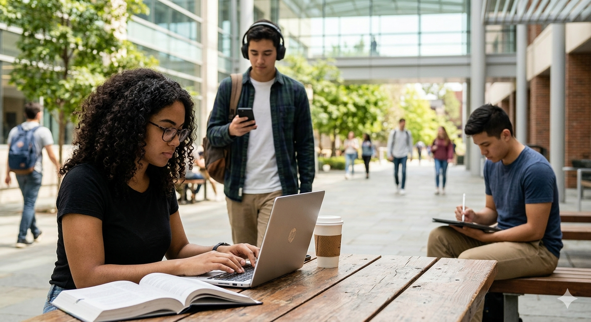
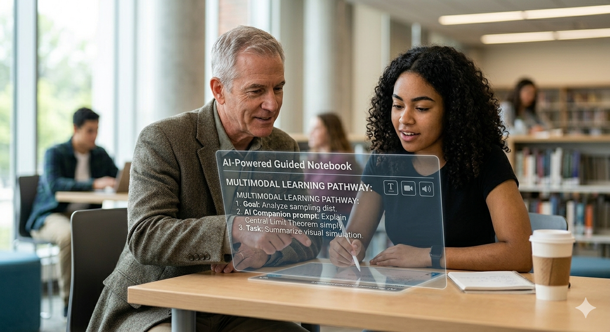
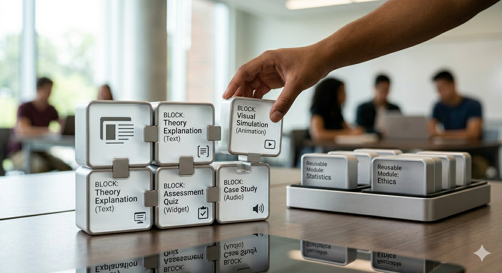

# Multimodal learning: where technology meets pedagogy  

When I look at how my students learn today, one thing is immediately clear: there is no such thing as a typical learner anymore. In the same course, I will see one student reading carefully on a laptop, another listening to audio while commuting, and a third jumping straight into practice questions on a phone.

As an educational technologist, teacher, researcher, and director of a Teaching and Learning Centre, I have stopped asking which medium is best and started asking a different question: how can we design for many ways of learning at once. That is at the heart of my keynote on multimodal learning, where technology and pedagogy meet in a very practical way to support student success.

For decades, higher education has been built around one size fits all teaching: one lecture, one textbook, one exam. But learners do not arrive as blank slates, and they certainly do not all thrive in the same format. Personalized learning, for me, is not the fantasy of building a fully custom course for every student. That is neither realistic nor sustainable. Instead, it means creating well designed educational pathways with a rich mix of media, so that students can engage with content in different ways without losing sight of the learning goals.

In practice this means combining text for deep reading, short videos and animations for demonstrations, audio for learners who prefer to listen on the move, interactive widgets for experimentation, and assessment tools that offer immediate feedback. When we developed an [open, multimedia statistics book](https://shklinkenberg.github.io/Statistical-Inference/01-samplingdistr.html), We saw students naturally gravitate to different combinations of materials. Some stayed mainly with the written explanations and occasional practice questions. Others moved quickly to short videos and interactive exercises. The point was not to crown a single superior medium. The real value was in giving students meaningful choices and then learning from their patterns of use.

## Balancing Guidance and Autonomy

At the same time, we are at a turning point where media is no longer something that students only consume. With generative artificial intelligence, students can co create explanations, examples, and even practice tasks. That opens up exciting opportunities, but it also raises a fundamental didactic question: how do we balance guidance and autonomy.

If we provide too much guidance, students become passive and wait for us, or for the AI, to do the thinking for them. If we provide too much autonomy, students can feel lost and unsure about what good learning looks like. In my work, I experiment with AI as a guided companion rather than an answer machine. For example, an AI chat environment that is connected to the course materials and learning objectives can help students clarify goals in their own words, get tailored explanations at the right level, and generate practice questions while still being asked to justify their answers.

Alongside this, tools like AI powered notebook environments give learners more control over how they organize resources, connect ideas, and ask deeper questions. Here the role of the educator shifts. I no longer see myself primarily as a content deliverer, but as a learning architect. My job is to design the space, the personas, and the constraints within which students and AI can interact in a way that supports genuine learning rather than shortcuts.

## Assessment driven learning

If assessment drives learning, then we also have to rethink the way we assess. Traditional exams often reward short term memorization and fast recall under pressure. They rarely resemble the kind of thoughtful, iterative problem solving we want graduates to be capable of in real life. In my keynote, I will show how authentic, multimedia rich assessment can function as e learning in itself.

Consider scenario based quizzes that incorporate images, audio, or video, or interactive tasks in which students explore data, make decisions, and see the consequences of their choices. Think of assignments where students create media, such as a short video, an infographic, or a narrated walkthrough, to demonstrate understanding. These forms of assessment remain tightly connected to clear learning goals, but they also promote critical thinking and self regulated learning. Students must plan their work, monitor their progress, and reflect on their approach. Those are skills they will need long after they leave our institutions.

For educational designers, this creates a demanding but exciting design challenge. How do we create rich multimedia experiences without overwhelming learners. We need clear structure, meaningful and timely feedback, and a sensible balance between challenge and complexity. When we get this right, assessment is no longer just a measurement tool. It becomes a powerful part of the learning journey.

## Open Educational Resources

All of this only makes sense if we also talk about sustainability and responsibility. As we embrace new media and artificial intelligence, we must ask whether we are building tools and content that can be reused, remixed, and improved over time. Are we empowering teachers and students to contribute, or are we locking them into closed systems that are difficult to adapt.

I often describe my preferred approach as the [Lego approach](https://podcasts.apple.com/nl/podcast/the-learning-curve/id1689174879?l=en-GB&i=1000662280575). We design small, robust building blocks: activities, media elements, assessment items. These blocks can be combined in many different ways for different courses and contexts. Open educational resources play a key role here. When we share not only content, but also design patterns and examples, innovation stops being an isolated effort by a few enthusiasts and becomes a shared project. The sum can genuinely be greater than the parts if we design for openness and reuse from the beginning.

This requires a shift in mindset. We need to think in terms of a shared ecosystem of learning experiences. Collaboration becomes more important than ownership. That is not always easy in institutions that are used to ranking, evaluation, and individual achievement, but it is essential if we want technology and pedagogy to grow together in a sustainable way.  

In the keynote, I will not promise magical solutions or claim that artificial intelligence will solve the problems of education. I think we need something more honest and more useful than that. I hope to offer concrete examples of multimodal learning in practice, a realistic view of what currently works and what does not, and practical ways for media professionals, teachers, and support staff to collaborate on building better learning pathways. Technology will keep changing. Pedagogical ideas will keep evolving. Our real opportunity lies in how we bring them together, deliberately, ethically, and creatively, to co create meaningful learning experiences for all our students.